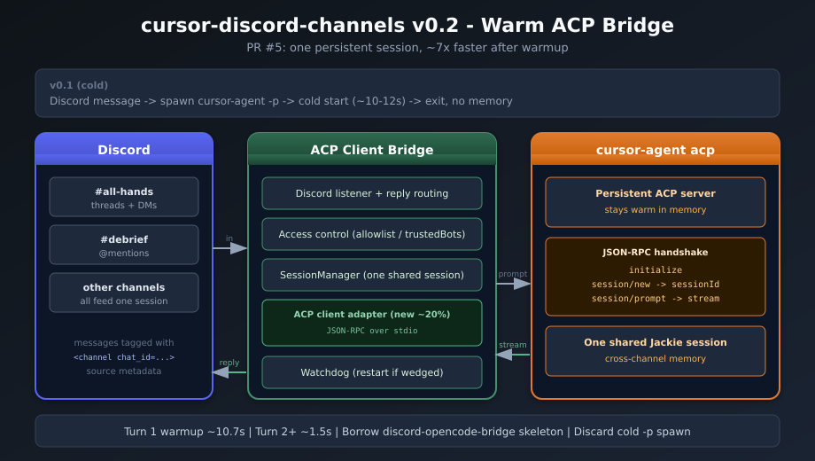
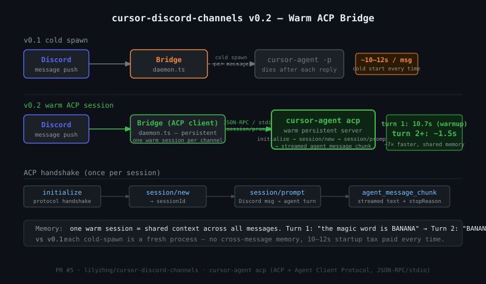
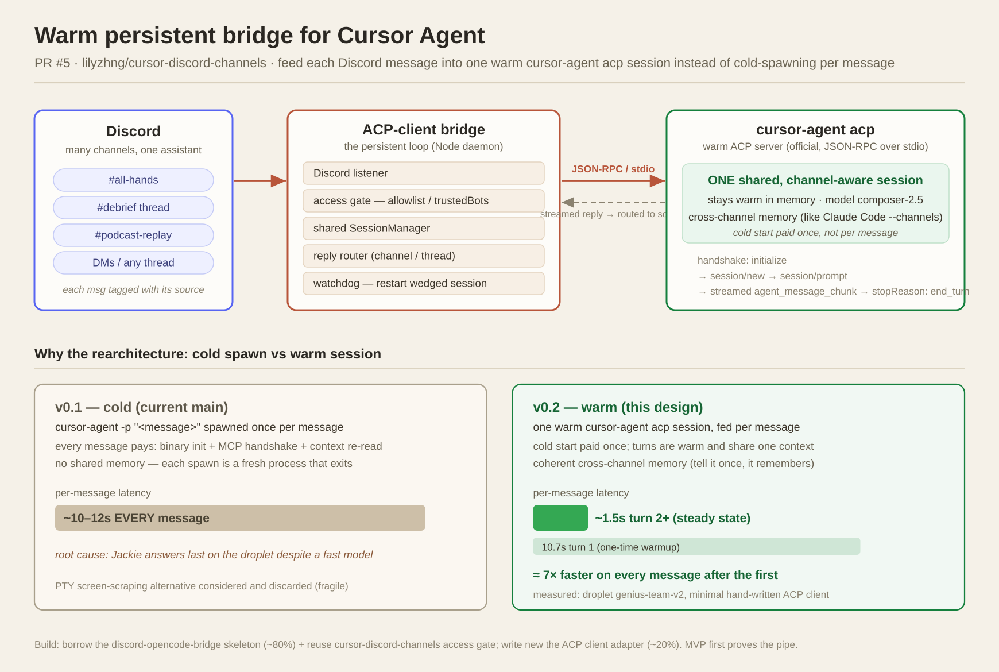

# Benchmarks

Real measurements taken on the live droplet (`genius-team-v2`) against the actual
running agents, not synthetic harnesses. Two things are measured here:

1. **Warm bridge speedup** (v0.1 cold-spawn vs v0.2 warm ACP session).
2. **Cross-model agentic race** (three models, same task, same tools).

All timings are end-to-end Discord wall-clock (the latency a human actually feels):
from the prompt message timestamp to the agent's reply timestamp.

---

## 1. Warm bridge: v0.1 cold vs v0.2 warm

v0.1 ran `cursor-agent -p "<message>"` once per Discord message: a cold start
(binary init + MCP handshake + context re-read) every time, with no memory across
messages. v0.2 holds one persistent `cursor-agent acp` session and prompts it each
turn, so the cold-start cost is paid once and every later turn is warm.

Measured on Jackie (genius-product), via the bridge journal:

| Turn | Type | Time |
|------|------|------|
| 1 | cold start + first turn | 12.6s |
| 2 | warm + memory recall | 2.5s |
| 3 | warm | 1.2s |
| 4 | warm + real file read | 2.5s |

Steady-state warm turns land around **1.2 to 2.5s vs ~10 to 12s cold**, roughly a
**5 to 10x** speedup, plus shared cross-channel memory (verified: the agent recalled
a codeword planted three turns earlier, and tracked two independent projects across
two channels at once without bleed).

### Shell harness root-cause fix (found while benchmarking)

The agentic tasks below surfaced a real bug: Jackie's `cursor-agent` had **no `PATH`
at all**, so every shell command died with `cat: command not found` (exit 127). Root
cause was in the systemd unit: it set `Environment=PATH=...` *and*
`UnsetEnvironment=PATH`, and systemd applies `UnsetEnvironment` last, wiping the PATH
it was meant to replace. Fix was a drop-in clearing `UnsetEnvironment=` so the
configured PATH (with `/usr/bin`) reaches the agent and its bash. Before the fix a
render took ~250s of flailing; after, ~17s (mostly cold start). This is the fix that
unblocked the agentic race below.

---

## 2. Cross-model agentic race

One task, fired simultaneously to three agents on three different models, each in its
own Discord thread. The bridge gained an `ATTACH: /path` contract so an agent can post
a rendered image back through Discord.

**Task (full agentic loop):**

1. Read PR #5 in `lilyzhng/cursor-discord-channels` (`gh pr view` + `gh pr diff`).
2. Create an SVG diagram of the architecture the PR describes.
3. Render the SVG to a PNG with `rsvg-convert`.
4. Post the PNG back to the Discord thread.

This exercises real tool use end to end: shell (`gh`, `rsvg-convert`), file authoring
(the SVG), and media posting, not just text generation.

### Results

| Rank | Agent | Model | Time | Notes |
|------|-------|-------|------|-------|
| 1 | Jackie | Composer 2.5 | **42.3s** | Cleanest-for-the-speed. No clipping, all text fits. |
| 2 | Lucy | Sonnet 4.6 | **72.0s** | Nice handshake-sequence detail, but text clips off the right edge. |
| 3 | Andrej | Opus 4.8 | **103.0s** | Best aesthetics: biggest canvas, richest detail, cleanest layout. |

All three read the PR correctly (their captions prove genuine comprehension), rendered
valid PNGs, and posted them. The diagrams are real artifacts, verified not corrupt.

### The diagrams

**Jackie (Composer 2.5) — 42.3s.** Won on both speed and polish here: clean 3-column
flow, every box and arrow labeled, nothing clipped.

**Lucy (Sonnet 4.6) — 72.0s.** Good idea (the ACP handshake row), but the latency box
and memory note clip off the right edge.

**Andrej (Opus 4.8) — 103.0s.** Slowest, but the best-looking: a light-theme two-panel
"why the rearchitecture" with latency callouts.

### A second data point: pure code generation

Before the agentic task, the same three-way setup ran a self-contained coding task
(implement an LRU cache with O(1) get/put using a hashmap + doubly linked list, plus
3 unit tests). Both solutions verified correct against an independent test suite
(including the recency-ordering edge case).

| Agent | Model | Time |
|-------|-------|------|
| Jackie | Composer 2.5 | **5.8s** |
| Lucy | Sonnet 4.6 | **26.3s** |

### Takeaways

- **Composer 2.5 is the speed king**, by a wide margin, on both code generation
  (~4.5x) and the full agentic loop (~2.4x vs Opus). It is Cursor's speed-tuned
  coding model and these tasks play to it.
- **Composer's quality held up.** On the diagram it was not just faster than Sonnet,
  it was cleaner (no clipping). Speed did not cost correctness or polish here.
- **Opus 4.8 trades speed for richness.** Slowest, but the most detailed and
  best-looking diagram of the three.
- **Sonnet 4.6 sat in the middle** on speed and had the one visible execution flaw
  (clipping) on this run.

### Cost (the kicker)

The list-price comparison makes the speed result land harder. Jackie runs the
standard `composer-2.5` (not the fast variant):

| Model | Input ($/M tokens) | Output ($/M tokens) |
|-------|-------------------:|--------------------:|
| **Composer 2.5** (standard) | **$0.50** | **$2.50** |
| Composer 2.5 (fast variant) | $3.00 | $15.00 |
| **Sonnet 4.6** | $3.00 | $15.00 |

Standard Composer 2.5 is **~6x cheaper than Sonnet 4.6** on both input and output.
So on these tasks it was faster, at least as polished, *and* a fraction of the cost.
(We access it through a Cursor subscription, which bundles usage; the per-token
figures are the cost-efficiency signal, not a separate bill.) Composer is
Cursor-only with no standalone public API.

### Method notes

- n = 1 per task. Single trials, real variance exists; treat as directional, not a
  leaderboard. A 3-trial average would firm these up.
- Metric is end-to-end Discord wall-clock, identical input and tools for all three.
- The repo under test (`lilyzhng/cursor-discord-channels`) is public, so `gh` access
  was uniform across agents and not a confound.
